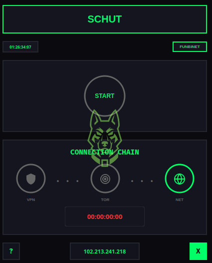
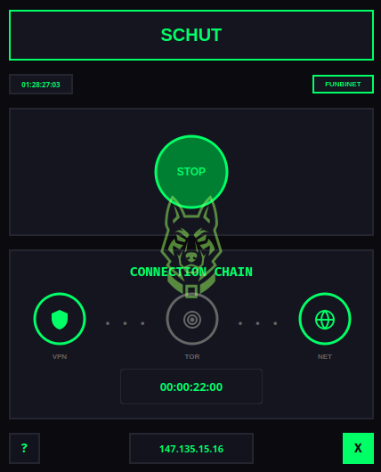
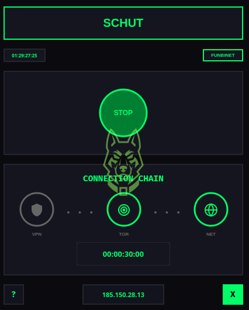
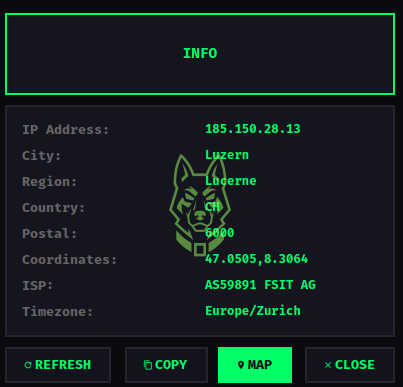
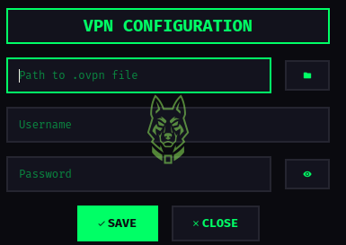

<p align="center">
  
</p>

<h1 align="center">SCHUT</h1>

<p align="center">
  <b>Secure Connection Hub & Unified Tunnel</b>
</p>

<p align="center">
  <strong>Codeberg:</strong> <a href="https://codeberg.org/funbinet">codeberg.org/funbinet</a> •
  <strong>GitHub:</strong> <a href="https://github.com/funbinet">github.com/funbinet</a> •
  <strong>License:</strong> Proprietary
</p>

<p align="center">
  <a href="mailto:funbinet@gmail.com">
    
  </a>
</p>

---

## Overview

**SCHUT** (Secure Connection Hub & Unified Tunnel) is a modern, feature-rich GUI
application for managing VPN, Tor network tunneling on Linux. Built with Python and
PyQt6, it provides a unified interface for establishing secure, anonymous internet
connections through a streamlined graphical interface. Now with SSH SOCKS Proxy support for additional tunneling options.

The application transforms complex anonymity workflows into a simple one-click
experience, eliminating the need to manually configure VPN clients, Tor services,
and iptables rules. SCHUT orchestrates the entire connection lifecycle from
VPN establishment to Tor transparent proxy configuration.

---

## Core Purpose

SCHUT addresses the fundamental challenges in maintaining online anonymity:

- **Configuration Complexity**: Setting up VPN + Tor + Proxy chains requires extensive technical knowledge
- **Manual Processes**: Coordinating VPN connections, Tor services, SSH tunnels, and firewall rules manually is error-prone
- **DNS Leaks**: Improper configuration can expose real IP addresses through DNS requests
- **Connection Management**: Difficult to monitor connection status and switch between modes
- **Kill Switch**: Lack of proper traffic protection when connections drop

SCHUT solves these problems by providing a single, integrated platform that
handles the entire anonymity workflow automatically.

---

## Architecture & Design

<p align="center">
  
</p>

### Unified Interface
- **Single Application**: One GUI for VPN, Tor, and network management
- **Visual Feedback**: Real-time status indicators for each connection layer
- **Modern Theme**: Clean, professional green-themed design
- **Session Tracking**: Built-in timer to monitor connection duration

### Secure Connection Chain
- **VPN First**: Establishes OpenVPN connection to mask origin IP
- **Tor Overlay**: Routes all traffic through Tor network over VPN
- **Transparent Proxy**: Automatic iptables configuration for system-wide protection
- **DNS Protection**: Forces all DNS through Tor to prevent leaks

### Intelligent Automation
- **One-Click Connection**: Single button to establish full VPN → Tor chain
- **Auto-Configuration**: Automatic torrc and iptables setup
- **Connection Modes**: VPN-only, Tor-only, or full chain options
- **Smart Recovery**: Automatic cleanup on disconnection or errors

---

## Connection Modes

SCHUT supports three primary connection modes:

### 1. Full Chain (VPN → Tor → Internet)
**Purpose**: Maximum anonymity with layered encryption.

**Flow**:
- Traffic → VPN Tunnel → Tor Entry → Tor Middle → Tor Exit → Internet

**Benefits**:
- VPN hides Tor usage from ISP
- Tor hides destination from VPN provider
- Double encryption layer
- Protection against Tor entry node logging

**Activation**: Click START button

### 2. VPN-Only Mode
**Purpose**: Fast, encrypted connection without Tor overhead.

<p align="center">
  
</p>

**Flow**:
- Traffic → VPN Tunnel → Internet

**Benefits**:
- Faster speeds than Tor
- IP masking from websites
- Encrypted tunnel to VPN server
- Access to geo-restricted content

**Activation**: Double-click VPN indicator

### 3. Tor-Only Mode
**Purpose**: Anonymous browsing without VPN dependency.

<p align="center">
  
</p>

**Flow**:
- Traffic → Tor Entry → Tor Middle → Tor Exit → Internet

**Benefits**:
- No VPN subscription required
- Tor's built-in anonymity
- Access to .onion services
- Decentralized routing

**Activation**: Double-click TOR indicator

---

## Key Features

### Professional GUI
- **Modern Interface**: Clean, professional green-themed design
- **Status Indicators**: Visual VPN, TOR, and NET connection states
- **Real-Time Clock**: Current time display with centisecond precision
- **Session Timer**: Track connection duration in HH:MM:SS format

### Connection Management
- **One-Click Start**: Single button to establish secure connection
- **Multiple Modes**: VPN-only, Tor-only, or full chain
- **IP Display**: Current external IP shown in interface
- **Quick IP Info**: Click IP button for detailed geolocation data

<p align="center">
  
</p>

### Security Features
- **Transparent Proxy**: System-wide traffic routing through Tor
- **DNS Leak Protection**: All DNS queries routed through Tor
- **IPv6 Disabled**: Prevents IPv6 leaks during connection
- **Kill Switch**: iptables rules block non-Tor traffic
- **MTU Optimization**: Prevents packet fragmentation issues

### User Experience
- **VPN Configuration**: Built-in dialog to configure OpenVPN settings
- **Password Visibility**: Eye icon toggle for password fields
- **Help Documentation**: Integrated help dialog with usage instructions
- **Non-Blocking UI**: Async operations keep interface responsive

---

## Technical Specifications

### System Requirements
- **Operating System**: Kali Linux (primary), Ubuntu/Debian (secondary)
- **Python Version**: 3.10 or higher
- **Memory**: 512MB RAM minimum
- **Storage**: 50MB free space
- **Privileges**: Root access required (sudo)

### Dependencies
- **Core Framework**: PyQt6 for GUI
- **VPN Client**: OpenVPN
- **Anonymity Network**: Tor service
- **Firewall**: iptables for transparent proxy

---

## Installation

### Quick Install (Debian/Ubuntu)
```bash
# Download the DEB package
wget https://github.com/funbinet/schut/releases/download/v1.0.0/schut_1.0.0_all.deb

# Install dependencies and package
sudo apt install openvpn tor iptables curl
sudo dpkg -i schut_1.0.0_all.deb

# Run SCHUT
schut
```

### Alternative: Manual Download
1. Go to [SCHUT Releases](https://github.com/funbinet/schut/releases/tag/v1.0.0)
2. Download `schut_1.0.0_all.deb`
3. Install with: `sudo dpkg -i schut_1.0.0_all.deb`
4. Fix any missing dependencies: `sudo apt --fix-broken install`

### First Run
1. **Configure VPN**: Click the settings (⚙) button
2. **Select .ovpn File**: Browse to your OpenVPN configuration file
3. **Enter Credentials**: Input VPN username and password
4. **Save Configuration**: Click Save to store settings
5. **Connect**: Click START to establish connection

---

## Usage

### Launching SCHUT
```bash
# From terminal (runs with root privileges automatically)
schut
```

### Connection Modes

| Mode | Description | Click Action |
|------|-------------|--------------|
| **VPN Only** | OpenVPN tunnel | Click START |
| **TOR Only** | TOR network routing | Click START |
| **VPN + TOR** | VPN then TOR chain | Enable both, START |

### Interface Controls

| Button | Function |
|--------|----------|
| **START** | Establish selected connection(s) |
| **STOP** | Terminate all active tunnels |
| **⚙ (Settings)** | Configure VPN credentials |
| **? (Help)** | View documentation |
| **✕ (Close)** | Exit application |

---

<p align="center">
  
</p>

---

## Usage

### Basic Operation
1. **Start SCHUT**: `sudo python3 schut.py`
2. **Click START**: Establishes VPN → Tor → Internet chain
3. **Monitor Status**: Watch VPN, TOR, NET indicators turn green
4. **View IP**: Click IP button to see current external IP
5. **Click STOP**: Disconnects and restores network settings

### Keyboard Shortcuts
- **Double-Click VPN**: Connect VPN-only (skip Tor)
- **Double-Click TOR**: Connect Tor-only (skip VPN)
- **Click IP Button**: View detailed IP information
- **Click ? Button**: Open help documentation

### Status Indicators
| Status | VPN | TOR | NET |
|--------|-----|-----|-----|
| Disconnected | Gray | Gray | Gray |
| Connecting | Loading | Loading | Loading |
| Connected | Green | Green | Green |
| Error | Red | Red | Red |

---

## Security & Privacy

### Traffic Protection
- **All Traffic Routed**: System-wide transparent proxy, not just browser
- **No Leaks**: iptables rules prevent non-Tor traffic
- **DNS Security**: All DNS queries through Tor's DNS port
- **IPv6 Blocked**: Prevents IPv6 bypass attacks

### Privacy Considerations
- **VPN Credentials**: Stored locally in encrypted config file
- **No Logging**: SCHUT does not log connection activity
- **Local Only**: No telemetry or external connections by SCHUT itself
- **Clean Disconnect**: Original network settings restored on exit

### Ethical Use
- **Authorization Required**: Only use on networks you own or have permission to test
- **Legal Compliance**: Ensure VPN and Tor usage is legal in your jurisdiction
- **Responsible Use**: Do not use for illegal activities

---

## Troubleshooting

### VPN Won't Connect
- Verify .ovpn file path is correct
- Check VPN credentials are valid
- Ensure OpenVPN is installed: `which openvpn`
- Check VPN server is reachable

### Tor Won't Connect
- Verify Tor is installed: `which tor`
- Check Tor service status: `systemctl status tor`
- Ensure port 9050 is available
- Try restarting Tor: `sudo systemctl restart tor`

### No Internet After Connection
- MTU issues: SCHUT uses optimized MTU settings
- Wait for full connection (all indicators green)
- Check IP button shows valid external IP
- Try disconnecting and reconnecting

### Connection Drops
- VPN server may have timed out
- Network interruption occurred
- Click STOP then START to reconnect

---

## Author Information

**funbinet** is a cybersecurity specialist currently pursuing a Computer Science
degree at Chuka University. With expertise in network security, anonymity systems,
and security tool development, funbinet develops comprehensive security solutions
that advance the field of privacy and anonymity.

### Background
- **Education**: Computer Science student at Chuka University
- **Specialization**: Network Security, Anonymity Systems, Privacy Tools
- **Experience**: Developing security and privacy tools
- **Philosophy**: "Privacy is a fundamental right, not a privilege"

### Projects
- **SCHUT**: Secure VPN + Tor connection manager
- **LEVIATHAN**: Complete penetration testing suite
- **OMNISEC**: Comprehensive defensive security platform
- **Various Security Tools**: Custom security automation tools

### Contact
- **Email**: funbinet@gmail.com
- **Codeberg**: https://codeberg.org/funbinet
- **GitHub**: https://github.com/funbinet

---

## License

### Proprietary Software License

Copyright (c) 2025 funbinet

All rights reserved.

This software is the property of funbinet and is protected by copyright laws
and international copyright treaties. No part of this software may be reproduced,
distributed, or transmitted in any form or by any means, including photocopying,
recording, or other electronic or mechanical methods, without the prior written
permission of funbinet, except in the case of brief quotations embodied in
critical reviews and certain other noncommercial uses permitted by copyright law.

### Restrictions:

1. **No Redistribution**: You may not redistribute this software, in whole or in part, to any third party.
2. **No Modification**: You may not modify, adapt, translate, reverse engineer, decompile, or disassemble this software.
3. **No Commercial Use**: You may not use this software for commercial purposes, including but not limited to selling, renting, licensing, or distributing the software for a fee.
4. **No Transfer**: You may not transfer, lease, or sublicense this software to any other party.

### Limited License:

A limited, non-exclusive, non-transferable license is granted to the original
licensee for personal, non-commercial use only. This license is subject to all
terms and conditions of this agreement.

### Disclaimer:

This software is provided "as is" without warranty of any kind, express or
implied. funbinet shall not be liable for any damages arising from the use of
this software.

### Termination:

This license will terminate automatically if you violate any of these terms and
conditions. Upon termination, you must immediately cease all use of the software
and destroy all copies in your possession or control.

### Source Code Access

The source code for SCHUT is proprietary and not publicly available. If you
are interested in accessing the source code for research, educational, or
legitimate security purposes, please contact the author directly at funbinet@gmail.com
to discuss licensing and access arrangements.

---

<p align="center">
  <b>SCHUT</b> — Secure Connection Hub & Unified Tunnel
  <br>
  <small>© 2025 funbinet • Proprietary Software • All Rights Reserved</small>
</p>
